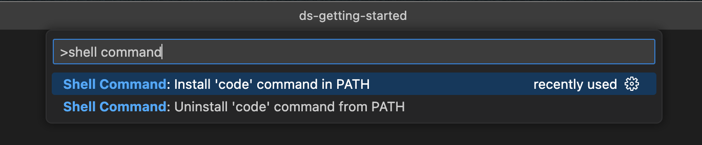
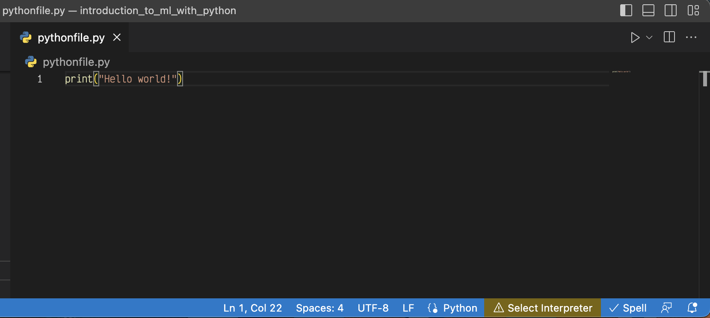
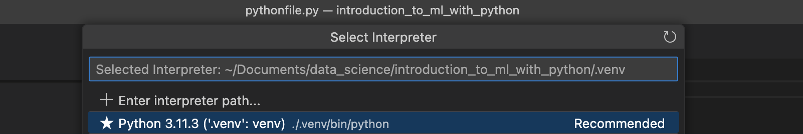
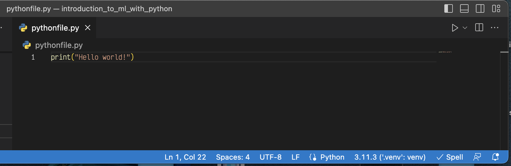
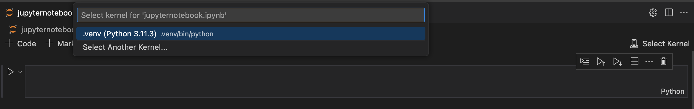

# VSCode setup

This markdown file contains a short description on how to set up VS Code and will answer the following questions...

* What is VS Code?
* [How do I install VS Code?](#installing-vs-code)
* [How do I install extensions for VS Code?](#installing-helpful-extensions)
* [How do I open VS Code from the terminal?](#opening-vs-code-from-terminal)
* [How do I select a virtual environment in VS Code](#virtual-environments-in-vs-code)
* [How do I work with jupyter notebooks in VS Code?](#juypter-notebooks-in-vs-code)

Throughout the Bootcamp and also afterwards when working in Data Science you will work a lot with jupyter notebooks. Jupyter notebooks are a fantastic tool to analyse and clean your data, visualise it and develop machine learning models. Typical tools to create and execute jupyter notebooks are JupyterLab or Jupyter Notebook (yes, the naming is a bit confusing), but there is also an powerful alternative: [Visual Studio Code](https://code.visualstudio.com/) or other IDEs (e.g. PyCharm).

VS Code is a free IDE (integrated development environment), which is available for macOS, Linux and Windows. An IDE is like a toolbox especially designed for software development. VS Code is a powerful source code editor, that supports many different programming languages with additional features like a debugger and compiler, syntax highlighting, code spell checking, linting and formatting, and much more. It has a rich marketplace for extensions and can also be used to create and execute jupyter notebooks. With and IDE like VS Code, you can seamlessly work on jupyter notebooks for analysing your data and developing ML models and also create Python scripts, that are later used for deployment.

---
## Installing VS Code

You can download VS Code from their [website](https://code.visualstudio.com/Download). Make sure to select the `.zip` version for your operating system. If you have a MacBook, you can choose between the `Intel chip` and `Apple silicon` version. If your MacBook has an M1 or M2 chip, you'll need to select the `Apple silicon` version.</mark>
After downloading the file all you need to do is moving it from the `Downloads` to the `Applications` folder.

<mark> If you don't know whether your MacBook has an Intel or M1/M2 chip, you can check if if you click on the apple logo in the top left corner of the screen and select `About This Mac`.</mark>

---
## Installing helpful extensions

In order to get the most out of your VSCode you need to customize it. To customize your VS Code you can install extensions from the [marketplace](https://code.visualstudio.com/docs/editor/extension-marketplace). 
On the left side of your VS Code window you can find a navigation bar with several icons. To go to the marketplace click on the extension icon, which is composed of four little squares. 

If you don't know where to start, we recommend to install the following extensions for the beginning:
* Python
* Code Spell Checker
* autoDocstring - Python Docstring Generator
* GitLense - Git supercharged
* Rainbow CSV

---
## Opening VS Code from Terminal

We will navigate a lot between different repositories in our terminal. VS Code offers a convenient way to open a specific folder in VS Code directly from the terminal. In order to [install the terminal command](https://code.visualstudio.com/docs/setup/mac#_launching-from-the-command-line) we need to open the command palette with the keyboard combination `Shift+CMD+P`. Search for `shell command` and select `Shell command: Install code command in PATH`. 

Now you can open a VS Code window from the terminal with the command `code <path/to/folder>`. A nice shortcut to open the current directory in VS Code is `code .`. 

---
## Virtual environments in VS Code

We will work a lot with different [virtual environments](https://code.visualstudio.com/docs/python/environments). If you want to execute a Python script inside a virtual environment, you need to select the correct Python interpreter at the bottom right of your VS Code window.

If you click on `Select Interpreter` it will open a list of available environments. Make sure to select the one from your current project. The name should be `.venv` and the path should point to your current directory `./.venv/bin/python`.

After selecting the correct environment, the name and the Python version used in your virtual environment will be shown on the bottom right of your window.

> Note: Before you start working in a notebook or on a python script, do make sure you are using the right environment! This way you can avoid installing libraries in the wrong place or getting errors for missing libraries.

---
## Juypter notebooks in VS Code

To work with [juypter notebooks in VS Code](https://code.visualstudio.com/docs/datascience/jupyter-notebooks) you need to create a virtual environment and install the `Jupyter package` (e.g. by running `pip install jupyterlab` in your terminal). Once you've done this you can open an existing jupyter notebook or create a new one by creating a new file with the extension `.ipynb`.

After opening a jupyter notebook, you need to select the right kernel in the top right corner of the notebook. 

Make sure you select the correct virtual environment for your project. The name should be `.venv` and your selected Python version and the path should point to the current directory `.venv/bin/python`.

<mark> Troubleshooting: Sooner or later it will happen that you open a notebook, run a cell and it will complain that e.g. packages cannot be found. This is usually caused by selecting the wrong virtual environment as a kernel. Make sure it is your `.venv` for this project. </mark>
