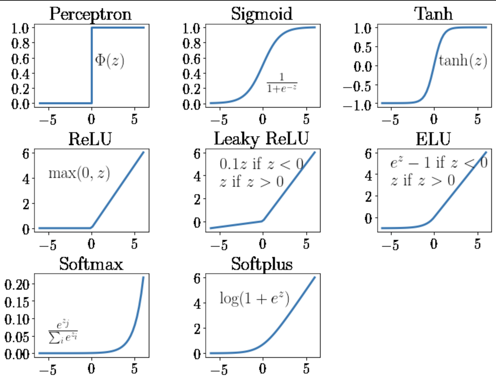

# Activation functions

### **An activation function is a function that is applied to the output of neural network neuron to determine its final output.**

# **There are different kinds of activation functions:**

# Linear activation functions

The linear activation function is defined as:
$ f(x) = x $

### Definition and Use Case:
- **Simplicity**: The output is directly proportional to the input.
- **No Non-linearity**: It does not introduce non-linearity, which limits the model's ability to learn complex patterns.
- **Use Case**: Should be only used in the **output layer**, otherwise the neural network capability to learn is limited.

### Advantages:
- **Interpretability**: Easy to understand and interpret the output.
- **Gradient Flow**: No vanishing or exploding gradient issues.

### Disadvantages:
- **Limited Learning**: Cannot capture complex patterns due to lack of non-linearity.

# Non-linear activation functions

## ReLU Activation Function
The ReLU activation function is defined as:
$ f(x) = \max(0, x) $
For positive input, ReLU returns x, otherwise it returns 0.
### Characteristics:
- **Non-linearity**: Introduces non-linearity, enabling the model to learn complex patterns.
- **Sparsity**: Activates only a portion of the neurons, making the network efficient.
- **Vanishing Gradient Problem**: Mitigates the vanishing gradient problem, which is common in sigmoid and tanh functions.
### Use Case:
- **Hidden Layers**: Commonly used in hidden layers of deep neural networks.
### Advantages:
- **Efficient Computation**: Simple and fast to compute. Speeds up training.
- **Improved Training**: Helps in faster convergence during training.
### Disadvantages:
- **Dying ReLU Problem**: Neurons can become inactive and stop learning if they output zero for all inputs.
## Variants of ReLU
### Leaky ReLU
$ f(x) = \begin{cases}
x & \text{if } x > 0 \\
\alpha x & \text{if } x \leq 0
\end{cases} $
### Characteristics:
- **Non-zero Gradient**: Allows a small, non-zero gradient when the unit is not active ($\alpha$ is a small constant).
### Use Case:
- **Hidden Layers**: Used in hidden layers to address the dying ReLU problem.
### Advantages:
- **Prevents Dying ReLU**: Ensures neurons continue to learn.
### Disadvantages:
- **Hyperparameter Tuning**: Requires careful tuning of $\alpha$.
### Parametric ReLU (PReLU)
$ f(x) = \begin{cases}
x & \text{if } x > 0 \\
\alpha x & \text{if } x \leq 0
\end{cases} $
### Characteristics:
- **Learnable Parameter**: Similar to Leaky ReLU but $\alpha $ is not a constant and learned during training.
### Use Case:
- **Hidden Layers**: Used in hidden layers for adaptive learning.
### Advantages:
- **Adaptive Learning**: $\alpha $ is learned, making it more flexible.
### Disadvantages:
- **Complexity**: Increases the complexity of the model.
### Exponential Linear Unit (ELU)
$f(x) = \begin{cases}
x & \text{if } x > 0 \\
\alpha (e^x - 1) & \text{if } x \leq 0
\end{cases} $
### Characteristics:
- **Smooth Output**: Smooths the output and can produce negative values, which helps in centering the activations.
### Use Case:
- **Hidden Layers**: Used in hidden layers to improve learning dynamics.
### Advantages:
- **Improved Learning**: Helps in faster and more robust learning.
### Disadvantages:
- **Computationally Intensive**: More complex to compute than ReLU.
### Scaled Exponential Linear Unit (SELU)
$ f(x) = \lambda \begin{cases}
x & \text{if } x > 0 \\
\alpha (e^x - 1) & \text{if } x \leq 0
\end{cases} $
### Characteristics:
- **Self-normalizing**: Scales the output to maintain the mean and variance of the inputs, promoting self-normalizing properties.
### Use Case:
- **Hidden Layers**: Used in hidden layers to maintain self-normalizing properties.
### Advantages:
- **Self-normalization**: Helps in maintaining stable activations.
### Disadvantages:
- **Complexity**: More complex and computationally intensive.

## **Sigmoid Function:**

- **Definition and Use Case:**
    - Maps input value between 0 and 1
    - Commonly used for binary classification problems where outputs can be interpreted as probabilities
    - Primarily used in output layer for binary classification taks to get a probability 
- **Advantages:**
    - Probability Interpretation: Outputs can be directly interpreted as probabilities
    - Smooth Gradient: Helps in gradient-based optimization algorithms
- **Disadvantages:** 
    - Vanishing Gradient Problem: Gradients approach zero for large positive or negatie inputs, slowing down learning in deep networks
    - Not Zero-Centered: Outputs are always positive, which can lead to inefficient gradient updates

## **Tanh (Hyperbolic Tangent):**

- **Definition and Use Case:**
    - Similar to sigmoid but outputs values between -1 and 1, making it suitable for hidden layers where zero-centered outputs are beneficial
    - Often used in hidden layers due to zero-centered output
- **Advantages:**
    - Zero-centered output helps the network to learn faster and more efficiently!
    - Stronger Gradients: Compared to sigmoid, tanh has stronger gradients near zero, facilitating larger updates during training
- **Disadvantages:**
    - Vanishing Gradient Problem: Similar to sigmoid, gradients approach zero for large inputs, though less severe due to its stronger gradients near zero
    - Computationally Expensive: Like sigmoid, it involves exponential functions, which can slow down computation

## **Softmax activation function:**

- **Definition and Use Case:**
    - The softmax activation function takes in a vector of raw outputs of the neural network and returns a vector of probability scores
    - SoftMax activation function is commonly used in the final layer of neural networks to handle multi-class classification problems. It converts the logits (raw output scores) into probabilities, allowing the network to distribute probability across different classes.
- **Softmax VS Sigmoid:**
    - If your model’s output classes are NOT mutually exclusive and you can choose many of them at the same time, use a sigmoid function on the network’s raw outputs. If your model’s output classes are mutually exclusive and you can only choose one, then use a softmax function on the network’s raw outputs
- **Advantages:**
    - Probability Distribution: Softmax converts raw scores (logits) into probabilities, ensuring the output values sum to 1. This makes interpretation straightforward — each output represents the probability of a particular class.
    - Multi-Class Classification: Ideal for handling multi-class classification problems, as it highlights the most likely class while still giving information about other classes.
    - Amplification of Differences: Softmax magnifies the differences between outputs. Higher logits become more dominant, which can make decision-making clearer.
    - Smooth Differentiability: Softmax is smooth and differentiable, making it suitable for gradient-based optimization methods like backpropagation.
    - Probabilistic Confidence: Provides a sense of "confidence" in the predictions, which can be useful for applications needing uncertainty estimation
- **Disadvantages:** 
    - Sensitive to Outliers: Softmax can produce very confident predictions even with minor changes to input, especially when logits have large values. This makes the model sensitive to outliers.
    - Vanishing Gradient: When one class has a very high probability, gradients for other classes become very small, slowing down learning for less likely classes.
    - Lack of Robustness: In adversarial settings, softmax can be easily fooled by small input perturbations, leading  incorrect high-confidence predictions.
    - Computational Cost: Softmax involves exponentiation and normalization, making it slightly more computationally expensive than simpler activations like sigmoid or ReLU.
    - Overconfidence in Predictions: Softmax often produces highly confident predictions, even when the model is uncertain. This can be problematic in critical applications like medical diagnosis or autonomous systems.

## Conclusion

| Activation Function | Function Definition | Output Values | Use Case | Advantages | Disadvantages |
|--------------------|---------------------|--------------|----------|------------|---------------|
| **Linear**          | \( f(x) = x \)       | Same as input | Output layer | Easy to interpret, no gradient issues | Limited learning, no non-linearity |
| **ReLU**            | \( \max(0, x) \)     | 0 or positive input value | Hidden layers | Efficient computation, fast convergence | Dying ReLU problem |
| **Sigmoid**         | \( \frac{1}{1 + e^{-x}} \) | Between 0 and 1 | Output layer for binary classification | Probability interpretation, smooth gradient | Vanishing gradient, not zero-centered |
| **Tanh**            | \( \frac{e^x - e^{-x}}{e^x + e^{-x}} \) | Between -1 and 1 | Hidden layers | Zero-centered output, stronger gradients | Vanishing gradient, computationally expensive |
| **Softmax**         | Converts logits to probabilities | Between 0 and 1, sum to 1 | Output layer for multi-class classification | Probability distribution, multi-class handling, smooth differentiability | Sensitive to outliers, vanishing gradient, computationally expensive |

Choosing the right activation function is essential for the performance of a neural network. While linear activation functions are simple and interpretable, they lack the ability to capture complex patterns. ReLU and its variants introduce non-linearity and address issues like the vanishing gradient problem, making them popular choices in modern neural networks. Sigmoid and tanh functions are useful for their smooth gradients and probability interpretation but can suffer from vanishing gradient issues. Softmax is particularly useful for multi-class classification tasks. The choice of activation function depends on the specific use case, layer in the network, and the desired trade-offs between simplicity, computational efficiency, and learning capability.
