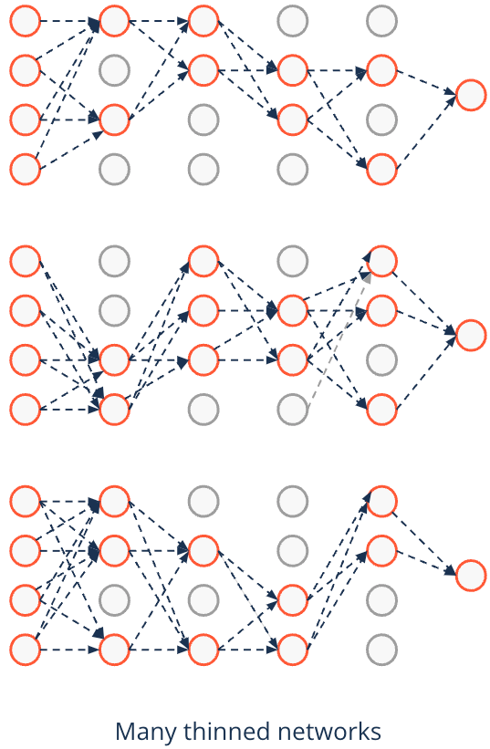

# Regularization in Neural Networks

## Overfitting, What We Don't Want
What we don't want is: 

Our neural network learning patterns that are:

-  too specific to the training data
- noise 

Why? Because it leads to poor generalization on unseen data. 

So, we regularize with these techtiques:

---

## Regularization Techniques: A comparison

| Regularization Method | When to Use | Pros | Cons |
|----------------------|------------|------|------|
| [**Early Stopping**](https://www.google.com/url?sa=t&rct=j&q=&esrc=s&source=web&cd=&cad=rja&uact=8&ved=2ahUKEwjq0qiE84aMAxXBOHoKHaQQNf0QwqsBegQIDRAF&url=https%3A%2F%2Fwww.youtube.com%2Fwatch%3Fv%3DBwepf5MtuaE&usg=AOvVaw3Qksz11IsrSAUmKOX4XJvp&opi=89978449)  | When training loss diverges from validation loss | Prevents overfitting efficiently | Requires validation monitoring |
| [**Dropout**](https://www.google.com/url?sa=t&rct=j&q=&esrc=s&source=web&cd=&cad=rja&uact=8&ved=2ahUKEwj09ODR84aMAxX7SvEDHddeGh8QwqsBegQIFBAF&url=https%3A%2F%2Fwww.youtube.com%2Fwatch%3Fv%3Dkry2JghtMSY&usg=AOvVaw3FZvFjbPanu4oGQYUkPyjd&opi=89978449) | Deep networks with many neurons | Reduces co-adaptation | Can slow down training |
| [**Batch Normalization**](https://www.google.com/url?sa=t&rct=j&q=&esrc=s&source=video&cd=&cad=rja&uact=8&ved=2ahUKEwiX9dbm84aMAxWvVfEDHUjFJQUQtwJ6BAgPEAI&url=https%3A%2F%2Fwww.youtube.com%2Fwatch%3Fv%3DXGmvEkifoyc&usg=AOvVaw0F72fz1B5O58XgjWKb_aO6&opi=89978449) | Deep networks with vanishing/exploding gradients | Stabilizes and speeds up training | May not work well with dropout |
| **L1 Regularization** | When sparsity is needed | Helps feature selection | Can remove useful weights |
| **L2 Regularization** | To prevent large weights | Keeps weights small and stable | Does not enforce sparsity |
| [**Data Augmentation**](https://www.google.com/url?sa=t&rct=j&q=&esrc=s&source=video&cd=&cad=rja&uact=8&ved=2ahUKEwjc9tj-84aMAxVWRvEDHasbIDAQtwJ6BAgIEAI&url=https%3A%2F%2Fwww.youtube.com%2Fwatch%3Fv%3DmTVf7BN7S8w&usg=AOvVaw3W0wwu-msdjVw3o4xAlOpj&opi=89978449) | Small datasets | Effectively increases data size | Only works for certain data types (e.g., images) |
| [**Noise Injection**](https://www.google.com/url?sa=t&rct=j&q=&esrc=s&source=video&cd=&cad=rja&uact=8&ved=2ahUKEwi3z-KY9IaMAxUaSvEDHUrYHj0QtwJ6BAgLEAI&url=https%3A%2F%2Fwww.youtube.com%2Fwatch%3Fv%3DqtrjmW7B2VM%26pp%3DygUEI25uNg%253D%253D&usg=AOvVaw1rdomrkVtnYGXajsz0Pmf5&opi=89978449) | To improve robustness | Increases model generalization | Needs tuning for best performance |
| **Ensemble Learning** | Improving accuracy with multiple models | Reduces variance, improves performance | Increases computational cost |
| **Max-Norm Regularization** | To control weight magnitudes | Prevents weight explosion | Requires fine-tuning constraints |

---


### 1. Early Stopping
- **How it works:** Stop training when validation loss stops improving.
- **Why it helps:** Prevents the model from learning noise in the data.
- **Implementation:** Monitor validation loss and stop training when it starts increasing.

```python
from tensorflow.keras.callbacks import EarlyStopping

callback = EarlyStopping(monitor='val_loss', patience=5)
model.fit(X_train, y_train, validation_data=(X_val, y_val), epochs=100, callbacks=[callback])
```
[Example inlcuding early stopping in TensorFlow](https://www.tensorflow.org/tutorials/keras/keras_tuner)
---

### 2. Dropout
- **How it works:**
    -   Randomly drops neurons during training.
    - Typically implemented with a dropout rate of 0.2-0.5
    - Only active during training, not during inference
- **Why it helps:** Reduces co-dependency between neurons, improving generalization.
- **Implementation:**


```python
from tensorflow.keras.layers import Dropout

model.add(Dense(128, activation='relu'))
model.add(Dropout(0.5))  # 50% neurons randomly dropped during training
```
<span>
Is there a minimum number of neurons required? There is <ins>no strict minimum number</ins> of neurons required. However, to preserve the networks learning capacity, its recommended to <ins>adjust the number of neurons based on the dropout rate</ins>
</span>


---

### 3. Batch Normalization
- **How it works:**     
Normalizes activations of each layer for each mini-batch
    - Faster convergence: Networks with BatchNorm often train 10-30 times faster than their counterparts without it.
    - Deeper networks: BatchNorm enables training of much deeper networks by preventing vanishing/exploding gradients.
    - The smaller the batch size, the stronger this regularization effect
    - Batch normalization introduces noise into the learning process.
- **Why it helps:** Stabilizes and speeds up training, sometimes acts as regularization.
- **Implementation:**

```python
from tensorflow.keras.layers import BatchNormalization

model.add(Dense(128, activation='relu'))
model.add(BatchNormalization())
```

---

### 4. L1 & L2 Regularization (Weight Decay)

#### **L1 Regularization (Lasso) - Encourages sparsity**
- Drives some weights to **exactly zero**, making the network simpler.
- Useful when selecting important features.

#### **L2 Regularization (Ridge) THE MOST COMMON - Penalizes large weights**
- Keeps weights small, reducing overfitting.
- Does not force weights to zero but makes them smaller overall.

#### **Implementation:**
```python
from tensorflow.keras.regularizers import l1, l2

model.add(Dense(128, activation='relu', kernel_regularizer=l1(0.01)))  # L1 Regularization
model.add(Dense(128, activation='relu', kernel_regularizer=l2(0.01)))  # L2 Regularization
```

---

### 5. Data Augmentation
- **How it works:** 
Generates variations of training data using transformations like rotation, flipping, cropping, and brightness changes.
- **Why it helps:** Increases dataset size, reducing overfitting.

```python
from tensorflow.keras.preprocessing.image import ImageDataGenerator

datagen = ImageDataGenerator(rotation_range=20, width_shift_range=0.2, height_shift_range=0.2, horizontal_flip=True)
augmented_data = datagen.flow(X_train, y_train, batch_size=32)
model.fit(augmented_data, epochs=50)
```

---

### 6. Noise Injection (Label Smoothing, Weight Noise, Input Noise)
- **How it works:** Introduces noise to inputs, weights, or labels to prevent the model from memorizing patterns.
- **Why it helps:** Improves generalization and model robustness.

```python
from tensorflow.keras.layers import GaussianNoise

model.add(GaussianNoise(0.1))  # Adds noise to inputs
```

---

<!-- ### 7. Transfer Learning & Pre-trained Models
- **How it works:** Uses a pre-trained model as a starting point instead of training from scratch.
- **Why it helps:** Reduces overfitting, especially on small datasets.

```python
from tensorflow.keras.applications import ResNet50

base_model = ResNet50(weights='imagenet', include_top=False)
``` -->

---

### 7. Ensemble Learning (Bagging, Boosting, Stacking)
- **How it works:** Combines multiple models to make predictions.
- **Why it helps:** Reduces variance and improves accuracy.

```python
from sklearn.ensemble import VotingClassifier

ensemble_model = VotingClassifier(estimators=[
    ('model1', model1),
    ('model2', model2)
], voting='soft')
```

---

### 9. Max-Norm Regularization
- **How it works:** Restricts the magnitude of weights.
- **Why it helps:** Prevents large weights from dominating the model.

```python
from tensorflow.keras.constraints import max_norm

model.add(Dense(128, activation='relu', kernel_constraint=max_norm(3.0)))
```

---

## Conclusion
- Use **early stopping** to prevent unnecessary training.
- Apply **dropout** to reduce dependency on specific neurons.
- Use **batch normalization** to stabilize and speed up training.
- Apply **L1/L2 regularization** to control weight sizes and enforce sparsity if needed.
- Use **data augmentation** to increase training diversity.
- **Experiment with combinations** of these techniques for optimal results.

[Cool link for the **opposite** of ANN!](https://wordasimage.github.io/Word-As-Image-Page/)